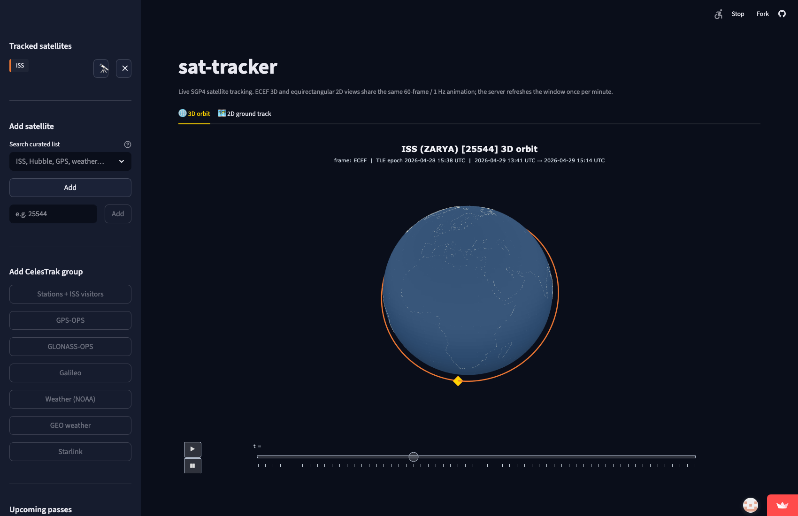

# sgp4-satellite-tracker

> **🛰 Try it live:** [https://sat-tracker-alex.streamlit.app/](https://sat-tracker-alex.streamlit.app/)
>
> Live SGP4 satellite tracking in your browser. ISS pre-loaded, click + add Hubble or GPS or Starlink, switch between 3D Earth-fixed and 2D ground-track views, predict passes from 10 preset ground stations or your own coordinates, follow any satellite with the camera. **Best viewed on desktop**; mobile is functional but cramped.

Real-time satellite tracking with SGP4 orbital propagation, TEME-to-WGS84 coordinate transformation, and IERS Earth Orientation Parameter corrections. Built in Python with a focus on the aerospace-software details that matter: time scale rigor, frame conversion correctness, and graceful degradation when upstream data sources fail.


*ISS over one full orbit — Earth-fixed (ECEF) frame, gold marker is the satellite's current position. Generated from a live CelesTrak TLE — no fixtures.*

```text
$ python -m sat_tracker
ISS (ZARYA) [25544]
  Time:     2026-04-29T00:46:36.836930+00:00
  Position: 27.0150°S, 68.9172°W
  Altitude: 423.6 km
```

## Why this project

I've watched rocket launches since I was a kid. The thing that grabbed me wasn't the launch itself but the moment after — when the launch announcer would say something like "we have acquisition of signal" or "tracking is nominal" and somehow follow a 7 km/s object through space accurately enough to know whether it was healthy. That kind of thing felt like magic and I wanted to understand it.
Tracking an active rocket is operationally hard — radar, optical, telemetry processing, multiple ground stations handing off, all happening in real time. So I started somewhere simpler: tracking satellites that are already in orbit, using the data and models that are publicly available. TLEs from CelesTrak. SGP4 for orbit propagation. IERS Earth Orientation Parameters for accurate ground-station geometry. The math has been public since the 1960s and 70s; the data sources are well-curated. One developer can credibly build this.
What I tried to do — and where most "satellite tracker" tutorials stop — is make it actually defensible as ground-tracking software. TLE checksum validation. Naive-datetime rejection (timezone bugs are how spacecraft get pointed at the wrong sky). EOP staleness checks (Earth's rotation drifts; pretending it doesn't is an error). Propagation error codes from SGP4 surfaced rather than swallowed. Degraded-mode operation when CelesTrak is unreachable, instead of crashing. The point isn't that the project tracks rockets — the point is that the parts of it that touch real systems are written like real systems.

## What it does

- Fetches Two-Line Element (TLE) data for any satellite by NORAD catalog number from CelesTrak — and entire CelesTrak groups (`stations`, `gps-ops`, `starlink`, `weather`, …)
- Validates TLE structure and checksums before propagation
- Propagates orbital state using the SGP4 algorithm (the standard used across the space industry)
- Converts inertial-frame state vectors (TEME) to Earth-fixed geodetic coordinates (WGS84 lat/lon/altitude) via ITRF
- Caches TLEs locally with TTL invalidation and atomic writes
- Falls back gracefully when CelesTrak or IERS are unreachable, with visible warnings
- Predicts upcoming passes over a ground station (AOS / max-elevation / LOS, azimuths, sunlit-vs-eclipsed visibility)
- Renders 2D ground tracks (cartopy / plotly) and 3D Earth-fixed orbit views (plotly), as static images or interactive HTML, with multi-satellite support, antimeridian splitting, and an optional ground-station marker + line-of-sight in the 3D view
- Ships a Streamlit dashboard with a live 60-frame / 1 Hz client-side animation, satellite picker (curated catalog + free-form catnr + CelesTrak group buttons), pass-prediction panel with 10 preset ground stations, and a follow-camera mode that locks the view onto a chosen satellite

### What it doesn't do

This tracker handles **Earth-orbiting satellites only**. SGP4 is a model designed for that regime; it does not produce meaningful trajectories for:

- **Satellites at Lagrange points** (JWST at L2, DSCOVR at L1) — these need n-body propagation, not the analytic two-body-plus-perturbations SGP4 uses
- **Heliocentric / interstellar probes** (Voyager 1/2, Spitzer post-mission) — different reference frame entirely; CelesTrak doesn't even publish TLEs for them
- **Lunar missions** (LRO, CAPSTONE) — likewise need a different propagator

The dashboard's curated satellite list is restricted to genuinely SGP4-tractable spacecraft for this reason; the CLI will surface a `TleFetchError` for catnrs CelesTrak doesn't carry.

## Quick start

```bash
git clone https://github.com/Alex0420W/sgp4-satellite-tracker
cd sgp4-satellite-tracker
pip install -e ".[dev]"               # core + tests
pip install -e ".[dev,viz]"           # also installs cartopy/matplotlib/plotly for `plot`
pip install -e ".[dev,viz,dashboard]" # also installs streamlit for `dashboard`
python -m sat_tracker                 # current ISS position
python -m sat_tracker dashboard       # local Streamlit dashboard at http://localhost:8501
```

That's it. First run downloads a few MB of EOP data; subsequent runs are offline-friendly within the cache TTL. The `[viz]` and `[dashboard]` extras are optional — `now` and `passes` work without either; only `plot` and `dashboard` need them.

## Dashboard

The deployable artifact: a single web URL at [https://sat-tracker-alex.streamlit.app/](https://sat-tracker-alex.streamlit.app/) that opens directly into a 3D ECEF view of the ISS, animation auto-playing at 1 Hz. Add satellites via the sidebar (search a curated 100+ list, type a NORAD catnr, or click a CelesTrak-group button to load Stations / GPS-OPS / Starlink-top-50 / etc.). Tab to the 2D ground-track view; the same tracked-list and animation state carry across.

[](https://sat-tracker-alex.streamlit.app/)

Notable features:

- **60-frame / 1 Hz client-side animation.** Server precomputes one minute of positions per minute_bucket; plotly animates between them in the browser at 1 Hz. The Streamlit script reruns once per minute (when the precompute window is about to expire) — sub-second `st.rerun()` thrash is structurally avoided. Smooth motion in the browser, idle server in between.
- **Follow-camera mode.** Click 🔭 next to a satellite chip to lock the camera onto its ECEF radial; the satellite stays centred while Earth visibly rotates underneath. Stop with the banner button or click the chip's ■.
- **Pass prediction with 10 preset ground stations.** Greenwich (default), Fort Collins, Kennedy SC, Johnson SC, Vandenberg, Baikonur, Kourou, Tokyo, Cape Town, Siding Spring Observatory — plus a "Custom" option for arbitrary lat/lon/alt. Each station change forces a fresh prediction by including the station tuple in the cache key.
- **EOP self-describing degradation.** The status row shows `EOP: fresh (IERS)` normally; when the live IERS fetch fails on startup the converter falls back to Skyfield's bundled timescale and the indicator flips to `EOP: bundled (refreshing…)`. A background thread retries the fetch; on success the cached converter is invalidated and the next rerun shows `EOP: fresh (IERS)`.
- **Colourblind-safe palette.** Multi-satellite plots use Paul Tol's "vibrant" qualitative palette so 5+ tracked satellites stay distinguishable, even with red/green deficiencies.

## CLI usage

```bash
# Track the ISS (default)
python -m sat_tracker

# Track another satellite by NORAD catalog number
python -m sat_tracker --catnr 20580          # Hubble Space Telescope

# Include raw TEME position/velocity vectors
python -m sat_tracker --catnr 25544 --verbose

# Live updates every N seconds
python -m sat_tracker --watch 3

# Predict ISS passes over a ground station for the next 24 hours
python -m sat_tracker passes --catnr 25544 --lat 40.59 --lon -105.08 --alt-km 1.5 --hours 24

# Render a 3D orbit hero
python -m sat_tracker plot --3d --catnr 25544 --output screenshots/iss_orbit_3d.png

# Launch the Streamlit dashboard
python -m sat_tracker dashboard
```

## Pass prediction

`sat-tracker passes` finds upcoming passes of a satellite over a ground station, including AOS / max-elevation / LOS times, azimuths at each, and a sunlit-vs-eclipsed visibility flag.

```text
$ python -m sat_tracker passes --catnr 25544 --lat 40.59 --lon -105.08 --alt-km 1.5 --hours 24 --station-name "Fort Collins"
ISS (ZARYA) [25544] passes over Fort Collins (40.5900°N, 105.0800°W)
3 pass(es) found in 24h window.

Pass 1 (duration 432s, max elevation 47.3°)
  AOS: 2026-04-29 02:14:33 UTC  az=312.2°
  MAX: 2026-04-29 02:18:11 UTC  az= 28.4°  el= 47.3°
  LOS: 2026-04-29 02:21:48 UTC  az=104.8°
  Visibility: sunlit (visible)

Pass 2 ...
```

Notes:

- **Default minimum elevation is 10°** (configurable via `SAT_TRACKER_MIN_ELEVATION_DEG` or `--min-elevation`). Below 10° atmospheric refraction and absorption make tracking unreliable for amateur stations.
- **Geostationary / deep-space satellites are gated out** before prediction — they do not "pass" over a fixed observer. The CLI returns an empty list and logs the actual mean motion.
- **Sunlit flag** uses Skyfield's planetary ephemeris (`de421.bsp`, ~16 MB, downloaded on first use). On ephemeris failure the flag becomes `None` (visibility unknown) but pass *timing* is unaffected.
- **Incomplete passes are skipped.** A pass that started before the window opens or hasn't finished by the time it closes is not reported.

## Visualization (CLI)

Two complementary views, both driven by the same `plot` subcommand. Backend is selected by output suffix — `.png` / `.pdf` / `.svg` go to a static renderer (cartopy for 2D, plotly+kaleido for 3D), `.html` produces an interactive plot. The `--3d` flag switches between 2D ground track (default) and 3D orbit view.

```bash
# Static 2D ground track
python -m sat_tracker plot --catnr 25544 --output screenshots/iss_ground_track.png

# Multi-satellite 2D — repeat --catnr; each track gets its own colour and legend entry
python -m sat_tracker plot --catnr 25544 --catnr 20580 --output screenshots/multi_ground_track.png

# Interactive HTML map
python -m sat_tracker plot --catnr 25544 --output iss.html

# Static 3D orbit hero
python -m sat_tracker plot --3d --catnr 25544 --output screenshots/iss_orbit_3d.png

# Multi-satellite 3D, with a ground-station marker + line-of-sight
python -m sat_tracker plot --3d --catnr 25544 --catnr 20580 \
    --gs-lat 40.59 --gs-lon -105.08 --gs-alt-km 1.5 --gs-name "Fort Collins" \
    --output multi_orbit.html
```

[](screenshots/multi_ground_track.png)

The 3D view uses an Earth-fixed (ECEF / ITRF) frame, not an inertial one. The same physical effect that makes the 2D ground track shift westward by ~22.5° between successive passes — Earth rotating beneath a (nearly) inertial orbit — is visible in 3D as a "spiral" trace when rendered over a multi-orbit window. Comparing the two views side-by-side is the fastest way to build intuition for why ground tracks tile the way they do.

Notes on the renderers:

- **Shared time grid + palette.** Both views call `precompute_track` / `precompute_orbit` from `visualization/common.py`. Multi-sat plots use the same Paul-Tol colour palette so a satellite is the same colour in 2D, 3D, and the dashboard.
- **Antimeridian splitting (2D only).** Tracks that cross ±180° are split into separate polylines so the renderer doesn't draw a horizontal line across the world map.
- **"Now" marker.** Gold star (2D) / gold diamond (3D) at the sample closest to "now", but only when that sample is within one time-step of "now" — outside the window the marker is suppressed rather than misleadingly pinned.
- **Line-of-sight geometry.** The 3D station-to-satellite line is drawn only when the satellite is geometrically above the station's local horizon — below-horizon satellites have no line of sight, so drawing one would be physically wrong.
- **Defer-imports.** `cartopy`, `matplotlib`, `plotly`, and `streamlit` are imported only inside the functions that need them. Importing `sat_tracker` on a machine without the `[viz]` or `[dashboard]` extras will not fail.

## Architecture

```text
+-----------------+   TLE bytes    +----------------+   StateVector  +-------------------+
|  tle_fetcher.py | -------------> | propagator.py  | -------------> |  coordinates.py   |
|                 |                |                |                |                   |
| CelesTrak with  |                | Wraps SGP4 with|                | TEME -> ITRF ->   |
| TTL cache and   |                | strict UTC     |                | WGS84 geodetic    |
| stale fallback  |                | enforcement    |                | with IERS EOP     |
|                 |                | + error xform  |                | + bundled fallback|
+-----------------+                +----------------+                +-------------------+
        |                                                                     |
        |                          +----------------+                         |
        +------------------------> |   passes.py    | <-----------------------+
                                   |                |
                                   | AOS/MAX/LOS    |
                                   | root-finding,  |
                                   | sunlit flag    |
                                   +----------------+
                                           |
                                           v
       +-------------------+      +-----------------------+      +-------------------+
       |   cli.py          |      | visualization/        |      | dashboard/        |
       | now / passes /    | -->  | common.py + figures.py|      | app.py + sidebar  |
       | plot / dashboard  |      | + ground_track.py +   |  +-> | + animation.py    |
       +-------------------+      | orbit_3d.py +         |  |   |                   |
                                  | interactive.py        |  |   |  ↳ st.cache_data  |
                                  +-----------------------+  |   |  ↳ session_state  |
                                           |                 |   |  ↳ plotly frames  |
                                           +-----------------+   +-------------------+
                                                                          |
                                                                  +-------v-------+
                                                                  | Streamlit     |
                                                                  | Cloud /       |
                                                                  | localhost     |
                                                                  +---------------+
```

`config.py` provides typed, frozen configuration loaded from environment variables, injected explicitly into each module rather than read as global state.

`passes.py` reuses the `Timescale` already loaded by `coordinates.CoordinateConverter` so EOP data is loaded once per process; the dashboard's `PassPredictor` singleton further reuses both across reruns.

**Two SGP4 propagation paths.** `propagator.py` calls the `sgp4` library directly (`Satrec.sgp4()`) for single-instant TEME state evaluation. `passes.py` uses Skyfield's higher-level `EarthSatellite.find_events()` for AOS / culminate / LOS root-finding because reimplementing robust elevation-threshold root-finding (with proper handling of short passes, circumpolar geometries, and numerical edge cases) is significantly more work than reimplementing single-instant propagation. Both paths produce identical positions — Skyfield wraps the same `sgp4` library internally — but expose different APIs.

**Visualization split.** `visualization/figures.py` builds in-memory `plotly.graph_objs.Figure` objects with no disk I/O — that's what the Streamlit dashboard imports. `visualization/interactive.py` and `visualization/orbit_3d.py` are thin disk-output shims (suffix-routed `write_html` / `write_image`) used by the CLI `plot` subcommand.

## Aerospace-software details that matter

These are the things that separate a working tracker from a *correct* one:

- **TLE checksum validation.** TLEs are distributed as text and can be corrupted in transit. Each line ends with a mod-10 checksum digit. We validate it before propagation — corrupted-but-well-formed TLEs would otherwise produce silently wrong positions.
- **Strict UTC enforcement.** SGP4 expects UTC datetimes. Naive Python datetimes (no timezone info) raise a `ValueError` rather than being silently assumed UTC — a 7-hour silent timezone error translates to thousands of kilometres of position offset.
- **Earth Orientation Parameter corrections.** TEME-to-geodetic conversion requires knowing Earth's actual rotation angle (UT1), which differs from UTC by up to ~0.9 seconds. The IERS publishes the offset as observed values plus short-term predictions. We use Skyfield's `Loader` to fetch up-to-date EOP data into the local cache; when unavailable, we fall back to Skyfield's bundled approximations and flag the resulting `GroundPosition` with `eop_degraded=True` so downstream code can react. Polar motion (x_p, y_p) is not modelled in this MVP — the ~5–10 m floor it imposes at the equator is acceptable for current scope.
- **Graceful degradation, four places now.** Stale TLE cache served when CelesTrak is unreachable. Bundled EOP used when IERS download fails. Watch-mode loop survives transient errors and aborts only after configurable consecutive failures. Dashboard background-refreshes EOP after a degraded startup. Each path logs visibly so degradation isn't silent.
- **Frame discipline.** SGP4 produces state vectors in TEME (True Equator Mean Equinox); we convert through ITRF to WGS84 ellipsoidal coordinates rather than treating any of those frames as interchangeable. Each transformation is named explicitly in code and documented in module docstrings.
- **Layered testing.** Fast-to-precise validation — smoke tests catch gross errors (LEO altitude regime, latitude bounded by orbital inclination), regression tests pin wrapper correctness against direct SGP4 invocation, the figure-builder tests assert no-disk-I/O contracts. Pass-prediction output spot-checked against Heavens-Above for a real ISS pass over Fort Collins (stage 6 commit).

## What I learned

Each stage exposed a class of bugs you only meet by writing real aerospace software:

- **Time scales aren't interchangeable.** SGP4 expects UTC, but TEME-to-ITRF rotation needs UT1, and Skyfield's internal arithmetic uses TT. The conversions between UTC ↔ UT1 ↔ TT ↔ TAI involve leap seconds and IERS offsets; `naive_dt.replace(tzinfo=timezone.utc)` is the kind of fix that compiles cleanly and produces silently wrong outputs forever. Stage 2's strict-UTC `ValueError` is an unsexy line of code that closes a whole bug class.

- **Frame conversions look like multiplications until they aren't.** TEME→ITRF needs the GMST angle, which needs UT1, which needs EOP data, which can fail to download, which means you need a fallback that's still *correct enough* to flag rather than abort. Stage 4's `eop_degraded` boolean threading through every `GroundPosition` is the project's single most-touched flag.

- **Caching's job is graceful failure, not speed.** `tle_fetcher`'s TTL cache is barely a performance win — TLEs are 200 bytes. Its actual job is "serve a stale TLE when CelesTrak 503s, with a visible warning." Same for the bundled-EOP fallback. Same for the dashboard's `minute_bucket` cache key — it's not about being fast, it's about being deterministic so reruns either hit-cleanly or miss-cleanly.

- **Validating against real-world data revealed how good SGP4 actually is.** Stage 6's spot-check (`tests/test_passes.py::test_heavens_above_reference_pass`) compares one ISS pass over Colorado against Heavens-Above's published prediction for the same TLE: AOS matches to **1.1 s**, max-elevation time to **<1 s**, LOS to **1.2 s**, and max-elevation to **the same integer degree Heavens-Above displays** (13°). Azimuth deltas at AOS/max/LOS are 0.14° / 0.08° / 0.67°. Tolerances we'd budgeted were ±60 s and ±2°; actual agreement was an order of magnitude tighter. Without that comparison the prediction code was "tests pass" but I had no idea whether the answers were physically correct — and whether root-finding precision was where the budget went, or somewhere else entirely.

- **Antimeridian splitting is the kind of detail that separates "I rendered a polyline" from "I rendered a ground track."** First version of the 2D plot drew a horizontal line across the entire world map every time the ISS crossed the dateline. The fix is one function (`split_at_antimeridian` in `visualization/common.py`) that took five minutes to write *after* I noticed the bug. Noticing the bug took a long stare at the wrong-looking image.

- **Streamlit's rerun model is fundamentally incompatible with sub-second updates** — every `st.rerun()` is a full WebSocket round-trip and DOM repaint. The 60-frame plotly animation pattern in `dashboard/animation.py` decouples server cadence (1 minute) from animation cadence (1 Hz) by precomputing a window of frames and letting plotly handle interpolation client-side. The server is idle ~99% of the time; the browser stays smooth. Took two iterations to get right; a stupid version of this would `st.rerun()` every second and look like a slide carousel.

- **Cross-iframe state preservation in Streamlit** isn't documented but works — `st.components.v1.html` iframes are sandboxed `allow-scripts allow-same-origin`, so a `sessionStorage` key written by one tab's plotly animation event handler is visible to the other tab's bootstrap script. That's how the 2D and 3D tabs preserve animation frame state across switches without reaching back through Streamlit's Python layer.

- **Follow-camera math is just ECEF arithmetic** at a 2-Earth-radii eye distance, but plotly's `frames` API needs `traces=[marker_idx]` set explicitly to scope each frame's data update — without it, the `data` array gets applied to *all* traces and you get a globe full of garbage. The kind of footgun that's only obvious in retrospect.

## Testing

```bash
python -m pytest -v
```

105 tests across 9 modules. Tests are isolated from network: TLE fetcher tests use mocked HTTP responses, EOP fallback tests use injected loaders, SGP4 error-code translation uses monkeypatched return values, visualization tests use the bundled Skyfield timescale and a fixed-fixture TLE, figure-builder tests assert no-disk-I/O. CI-safe and deterministic.

## Configuration

| Variable | Default | Purpose |
|---|---|---|
| `SAT_TRACKER_CACHE_DIR` | `./data` | Where TLE and EOP cache files live |
| `SAT_TRACKER_CACHE_TTL_HOURS` | `6` | TLE cache freshness window |
| `SAT_TRACKER_TLE_SOURCE_URL` | CelesTrak GP endpoint | TLE source (overridable for testing) |
| `SAT_TRACKER_LOG_LEVEL` | `INFO` | Root logger level |
| `SAT_TRACKER_HTTP_TIMEOUT_SECONDS` | `10` | HTTP request timeout |
| `SAT_TRACKER_USER_AGENT` | `sat-tracker/0.1 (+github.com/Alex0420W/sgp4-satellite-tracker)` | HTTP User-Agent (CelesTrak ToS) |
| `SAT_TRACKER_MIN_ELEVATION_DEG` | `10.0` | Minimum elevation threshold for pass detection (degrees) |

## Exit codes

The CLI uses distinct exit codes so calling scripts can react appropriately:

- `0` - success
- `2` - startup TLE fetch failed
- `3` - startup propagation failed
- `4` - watch mode aborted after consecutive failures exceeded threshold
- `5` - plot rendering failed (e.g. missing `[viz]` extras, bad `--start-utc`)
- `130` - SIGINT (Ctrl-C in watch mode)

## Tech stack

- Python 3.10+
- [`sgp4`](https://pypi.org/project/sgp4/) — Brandon Rhodes' Python port of Vallado's reference SGP4, validated against the SGP4-VER suite
- [`skyfield`](https://rhodesmill.org/skyfield/) — time scales, EOP loading, frame conversion
- `cartopy` + `matplotlib` — static 2D ground tracks (CLI only)
- `plotly` + `kaleido` — interactive 2D/3D and static-export rendering
- `streamlit` — dashboard
- `requests` — HTTP with connection pooling
- `pytest` — testing

## Future work

- Polar motion (x_p, y_p) integration into TEME-to-ITRF conversion
- Inertial-frame option exposed on the CLI (the renderer code path already exists; only a flag is missing)
- "Use my location" via browser geolocation in the dashboard (needs a custom Streamlit component)
- Auto-disable follow-camera on user drag in the dashboard (needs an iframe → server bridge)
- JSON output mode for piping into other tools

## Author

Alex Woods

- LinkedIn: [linkedin.com/in/alex-woods-678826289](https://www.linkedin.com/in/alex-woods-678826289/)
- Email: alex.binh.woods@gmail.com

