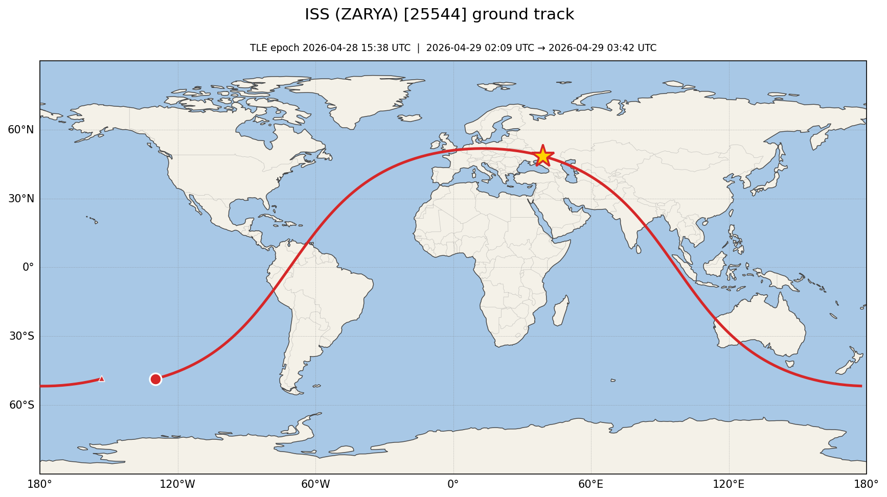
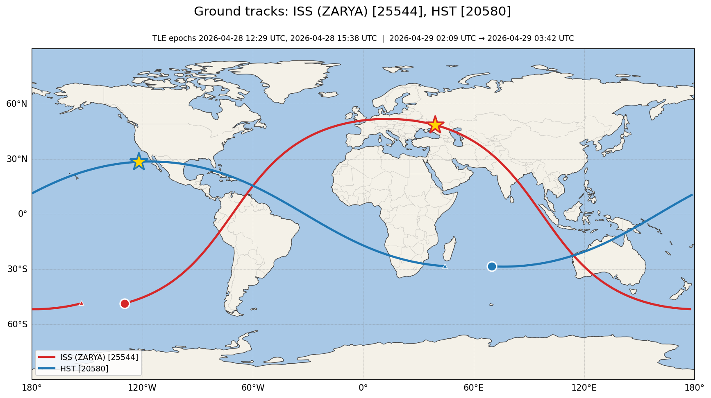
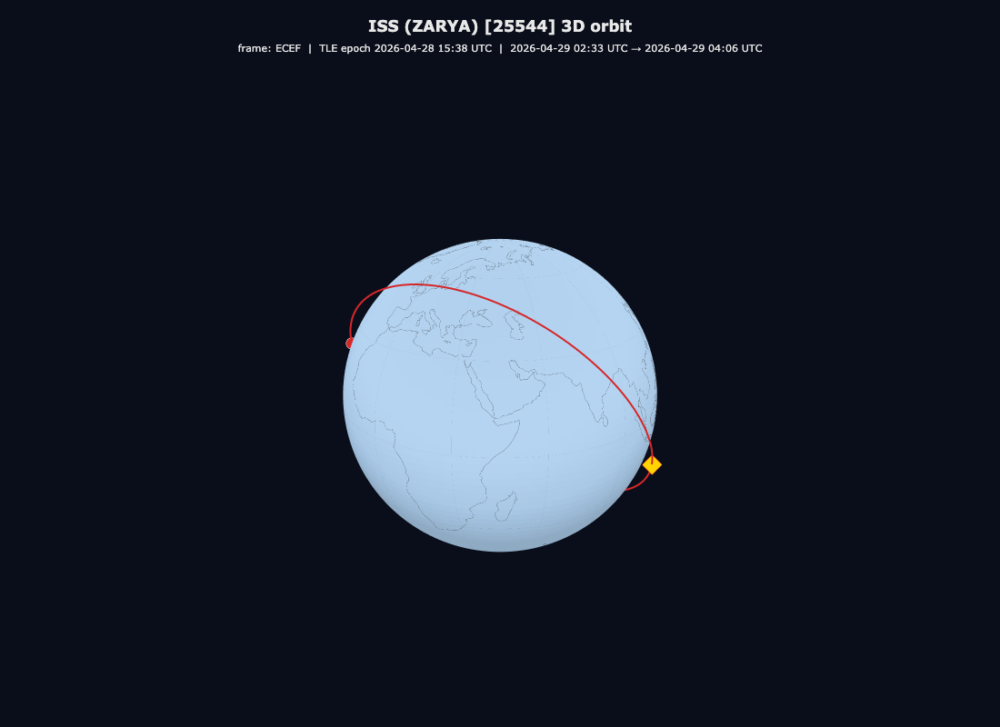

# sgp4-satellite-tracker

Real-time satellite tracking with SGP4 orbital propagation, TEME-to-WGS84 coordinate transformation, and IERS Earth Orientation Parameter corrections. Built in Python with a focus on the aerospace-software details that matter: time scale rigor, frame conversion correctness, and graceful degradation when upstream data sources fail.



*One full ISS orbit (~93 minutes) centred on now. Red ring marks the start of the window, gold star is the satellite's current position, triangle is the end. Generated from a freshly-fetched TLE — no fixtures.*

```text
$ python -m sat_tracker
ISS (ZARYA) [25544]
  Time:     2026-04-29T00:46:36.836930+00:00
  Position: 27.0150°S, 68.9172°W
  Altitude: 423.6 km
```

## Why this project

I built this as part of preparing to apply to NASA. Most "satellite tracker" tutorials stop at plotting a position with library defaults. This project goes further: it explicitly handles the things real ground-tracking software has to handle - TLE checksum validation, naive-datetime rejection, EOP staleness, propagation error codes, and degraded-mode operation when networks fail.

## What it does

- Fetches Two-Line Element (TLE) data for any satellite by NORAD catalog number from CelesTrak
- Validates TLE structure and checksums before propagation
- Propagates orbital state using the SGP4 algorithm (the standard used across the space industry)
- Converts inertial-frame state vectors (TEME) to Earth-fixed geodetic coordinates (WGS84 lat/lon/altitude) via ITRF
- Caches TLEs locally with TTL invalidation and atomic writes
- Falls back gracefully when CelesTrak or IERS are unreachable, with visible warnings
- Provides a CLI with one-shot and continuous (watch) modes
- Predicts upcoming passes over a ground station (AOS / max-elevation / LOS, azimuths, sunlit-vs-eclipsed visibility)
- Renders 2D ground tracks (cartopy / plotly) and 3D Earth-fixed orbit views (plotly) to interactive HTML or static images, with multi-satellite support and an optional ground-station marker + line-of-sight in the 3D view

## Quick start

```bash
git clone https://github.com/Alex0420W/sgp4-satellite-tracker
cd sgp4-satellite-tracker
pip install -e ".[dev]"           # core + tests
pip install -e ".[dev,viz]"       # also installs cartopy/matplotlib/plotly for `plot`
python -m sat_tracker
```

That's it. First run downloads a few MB of EOP data; subsequent runs are offline-friendly within the cache TTL. The `[viz]` extra is optional — `now` and `passes` work without it; only `plot` requires it.

## Usage

```bash
# Track the ISS (default)
python -m sat_tracker

# Track another satellite by NORAD catalog number
python -m sat_tracker --catnr 20580          # Hubble Space Telescope

# Include raw TEME position/velocity vectors
python -m sat_tracker --catnr 25544 --verbose

# Live updates every N seconds
python -m sat_tracker --watch 3

# Configurable failure tolerance in watch mode
python -m sat_tracker --watch 1 --max-failures 5

# Predict ISS passes over a ground station for the next 24 hours
python -m sat_tracker passes --catnr 25544 --lat 40.59 --lon -105.08 --alt-km 1.5 --hours 24
```

## Pass prediction

`sat-tracker passes` finds upcoming visible passes of a satellite over a ground station, including AOS / max-elevation / LOS times, azimuths at each, and a sunlit-vs-eclipsed visibility flag.

```text
$ python -m sat_tracker passes --catnr 25544 --lat 40.59 --lon -105.08 --alt-km 1.5 --hours 24 --station-name "Fort Collins"
ISS (ZARYA) [25544] passes over Fort Collins (40.5900°N, 105.0800°W)
3 pass(es) found in 24h window.

Pass 1 (duration 432s, max elevation 47.3°)
  AOS: 2026-04-29 02:14:33 UTC  az=312.2°
  MAX: 2026-04-29 02:18:11 UTC  az= 28.4°  el= 47.3°
  LOS: 2026-04-29 02:21:48 UTC  az=104.8°
  Visibility: sunlit (visible)

Pass 2 ...
```

Notes:

- **Default minimum elevation is 10°** (configurable via `SAT_TRACKER_MIN_ELEVATION_DEG` or `--min-elevation`). Below 10° atmospheric refraction and absorption make tracking unreliable for amateur stations.
- **Geostationary / deep-space satellites are gated out** before prediction — they do not "pass" over a fixed observer. The CLI returns an empty list and logs the actual mean motion.
- **Sunlit flag** uses Skyfield's planetary ephemeris (`de421.bsp`, ~16 MB, downloaded on first use). On ephemeris failure the flag becomes `None` (visibility unknown) but pass *timing* is unaffected.
- **Incomplete passes are skipped.** A pass that started before the window opens or hasn't finished by the time it closes is not reported — only passes with a complete rise + culminate + set inside the window appear in the output.

## Visualization

Two complementary views, both driven by the same `plot` subcommand. The 2D ground track shows the sub-satellite point traced across a world map; the 3D orbit shows the satellite's actual 3D position in the Earth-fixed frame. Backend is selected by output suffix — `.png` / `.pdf` / `.svg` go to a static renderer (cartopy for 2D, plotly+kaleido for 3D), `.html` produces an interactive plot. The `--3d` flag switches between 2D ground track (default) and 3D orbit view.

### 2D ground track

```bash
# Single-satellite ground track over one full orbit, centred on now
python -m sat_tracker plot --catnr 25544 --output screenshots/iss_ground_track.png

# Multi-satellite plot — repeat --catnr; each track gets its own colour and legend entry
python -m sat_tracker plot --catnr 25544 --catnr 20580 --output screenshots/multi_ground_track.png

# Interactive HTML map (hover for time / lat / lon / altitude per sample)
python -m sat_tracker plot --catnr 25544 --output iss.html

# Custom window: 6 hours starting at a specific UTC instant
python -m sat_tracker plot --catnr 25544 --hours 6 --start-utc 2026-04-28T12:00:00Z -o iss_6h.png
```

Multi-satellite example with the ISS (51.6° inclination, red) and Hubble (28.5°, blue) on one map — the inclination envelopes are immediately distinguishable:

[](screenshots/multi_ground_track.png)

### 3D orbit view

```bash
# Static 3D orbit hero, single satellite
python -m sat_tracker plot --3d --catnr 25544 --output screenshots/iss_orbit_3d.png

# Interactive HTML with a time slider scrubbing the satellite along the orbit
python -m sat_tracker plot --3d --catnr 25544 --output iss_orbit.html

# Multi-satellite, with a ground-station marker + line-of-sight at "now"
python -m sat_tracker plot --3d --catnr 25544 --catnr 20580 \
    --gs-lat 40.59 --gs-lon -105.08 --gs-alt-km 1.5 --gs-name "Fort Collins" \
    --output multi_orbit.html
```

[](screenshots/iss_orbit_3d.png)

The 3D view uses an Earth-fixed (ECEF / ITRF) frame, not an inertial one. The same physical effect that makes the 2D ground track shift westward by ~22.5° between successive passes — Earth rotating beneath a (nearly) inertial orbit — is visible in 3D as a "spiral" trace when rendered over a multi-orbit window. The two views are the same phenomenon at different visual abstractions; comparing them side-by-side is the fastest way to build intuition for why ground tracks tile the way they do.

Notes on the renderers:

- **Shared time grid.** Both views call `precompute_track` / `precompute_orbit` from `visualization/common.py`, which compute on the same uniform grid driven by mean motion. A multi-sat plot in either dimensionality uses the same colour palette (`DEFAULT_TRACK_COLORS` — ISS is red in both 2D and 3D).
- **Antimeridian splitting (2D only).** Tracks that cross ±180° are split into separate polylines so the renderer doesn't draw a horizontal line across the entire world map.
- **"Now" marker.** The gold star (2D) / gold diamond (3D) is placed at the sample closest to the current instant, but only when that sample is within one time-step of "now" — outside the window, the marker is suppressed rather than misleadingly pinned.
- **3D coastlines.** The 3D Earth sphere overlays the same Natural Earth coastlines that cartopy uses for the 2D basemap (charcoal, low opacity), so the 3D globe is legible against the ocean-blue base without needing a photo texture.
- **Line-of-sight geometry.** When a ground station is provided in 3D, the line from station to satellite is drawn only when the satellite is geometrically above the station's local horizon — below-horizon satellites have no line of sight, so drawing one would be physically wrong.
- **Defer-imports.** `cartopy`, `matplotlib`, and `plotly` are imported only inside the render functions. Importing `sat_tracker` on a machine without the `[viz]` extras will not fail.

## Architecture

Four modules, each with a single responsibility:

```text
+-----------------+   TLE bytes    +----------------+   StateVector   +-------------------+
|  tle_fetcher.py | -------------> | propagator.py  | --------------> |  coordinates.py   |
|                 |                |                |                 |                   |
| Fetches from    |                | Wraps SGP4 with|                 | TEME -> ITRF ->   |
| CelesTrak with  |                | strict UTC     |                 | WGS84 geodetic    |
| TTL cache and   |                | enforcement    |                 | with IERS EOP     |
| stale fallback  |                | and error      |                 | data and bundled  |
|                 |                | translation    |                 | fallback          |
+-----------------+                +----------------+                 +-------------------+
                                                                               |
                                                                               v
                                                                        +-------------+
                                                                        |   cli.py    |
                                                                        | wires it all|
                                                                        |  together   |
                                                                        +-------------+
```

`config.py` provides typed, frozen configuration loaded from environment variables, injected explicitly into each module rather than read as global state.

`passes.py` (added in stage 6) takes a `Tle` plus a `GroundStation` and returns a list of `Pass` objects. It reuses the `Timescale` already loaded by `coordinates.CoordinateConverter` so EOP data is loaded once per run.

**Two SGP4 propagation paths.** `propagator.py` calls the `sgp4` library directly (`Satrec.sgp4()`) for single-instant TEME state evaluation — this is what feeds the "current position" CLI. `passes.py` uses Skyfield's higher-level `EarthSatellite.find_events()` for AOS / culminate / LOS root-finding, because reimplementing robust elevation-threshold root-finding (with proper handling of short passes, circumpolar geometries, and numerical edge cases) is significantly more work than reimplementing single-instant propagation. Both paths produce identical positions — Skyfield wraps the same `sgp4` library internally — but expose different APIs. This is a deliberate architectural choice; see the module docstring at the top of `passes.py`.

## Aerospace-software details that matter

These are the things that separate a working tracker from a *correct* one:

- **TLE checksum validation.** TLEs are distributed as text and can be corrupted in transit. Each line ends with a mod-10 checksum digit. We validate it before propagation - corrupted-but-well-formed TLEs would otherwise produce silently wrong positions.
- **Strict UTC enforcement.** SGP4 expects UTC datetimes. Naive Python datetimes (no timezone info) raise a `ValueError` rather than being silently assumed UTC - a 7-hour silent timezone error translates to thousands of kilometres of position offset.
- **Earth Orientation Parameter corrections.** TEME-to-geodetic conversion requires knowing Earth's actual rotation angle (UT1), which differs from UTC by up to ~0.9 seconds. The IERS publishes the offset as observed values plus short-term predictions. We use Skyfield's `Loader` to fetch up-to-date EOP data into the local cache; when unavailable, we fall back to Skyfield's bundled approximations and flag the resulting `GroundPosition` with `eop_degraded=True` so downstream code can react. Polar motion (x_p, y_p) is not modelled in this MVP - the ~5-10m floor it imposes at the equator is acceptable for current scope; integration is listed under future work.
- **Graceful degradation, three places.** Stale TLE cache served when CelesTrak is unreachable. Bundled EOP used when IERS download fails. Watch-mode loop survives transient errors and aborts only after configurable consecutive failures. Each path logs visibly so degradation isn't silent.
- **Frame discipline.** SGP4 produces state vectors in TEME (True Equator Mean Equinox); we convert through ITRF to WGS84 ellipsoidal coordinates rather than treating any of those frames as interchangeable. Each transformation is named explicitly in code and documented in module docstrings.
- **Layered testing.** Fast-to-precise validation - smoke tests catch gross errors (LEO altitude regime, latitude bounded by orbital inclination), regression tests pin wrapper correctness against direct SGP4 invocation. Output spot-checked against `wheretheiss.at` during development.

## Testing

```bash
python -m pytest -v
```

95 tests across 8 modules. Tests are isolated from network: TLE fetcher tests use mocked HTTP responses, EOP fallback tests use injected loaders, SGP4 error-code translation uses monkeypatched return values, visualization tests use the bundled Skyfield timescale and a fixed-fixture TLE. CI-safe and deterministic.

## Configuration

All configuration via environment variables with sensible defaults:

| Variable | Default | Purpose |
|---|---|---|
| `SAT_TRACKER_CACHE_DIR` | `./data` | Where TLE and EOP cache files live |
| `SAT_TRACKER_CACHE_TTL_HOURS` | `6` | TLE cache freshness window |
| `SAT_TRACKER_TLE_SOURCE_URL` | CelesTrak GP endpoint | TLE source (overridable for testing) |
| `SAT_TRACKER_LOG_LEVEL` | `INFO` | Root logger level |
| `SAT_TRACKER_HTTP_TIMEOUT_SECONDS` | `10` | HTTP request timeout |
| `SAT_TRACKER_USER_AGENT` | `sat-tracker/0.1 (+github.com/Alex0420W/sgp4-satellite-tracker)` | HTTP User-Agent (CelesTrak ToS) |
| `SAT_TRACKER_MIN_ELEVATION_DEG` | `10.0` | Minimum elevation threshold for pass detection (degrees) |

## Exit codes

The CLI uses distinct exit codes so calling scripts can react appropriately:

- `0` - success
- `2` - startup TLE fetch failed (bad catnr, no network and no cache)
- `3` - startup propagation failed
- `4` - watch mode aborted after consecutive failures exceeded threshold
- `5` - plot rendering failed (e.g. missing `[viz]` extras, bad `--start-utc`)
- `130` - SIGINT (Ctrl-C in watch mode)

## Tech stack

- Python 3.10+
- [`sgp4`](https://pypi.org/project/sgp4/) - Brandon Rhodes' Python port of Vallado's reference SGP4 implementation, validated against the SGP4-VER suite
- [`skyfield`](https://rhodesmill.org/skyfield/) - time scales, EOP loading, frame conversion
- `requests` - HTTP with connection pooling
- `pytest` - testing

## Future work

- Polar motion (x_p, y_p) integration into TEME-to-ITRF conversion
- Inertial-frame option exposed on the CLI (the renderer code path exists; only a flag is missing)
- Streamlit web dashboard with live tracking
- JSON output mode for piping into other tools

## Author

Alex Woods

- LinkedIn: [linkedin.com/in/alex-woods-678826289](https://www.linkedin.com/in/alex-woods-678826289/)
- Email: alex.binh.woods@gmail.com

Built as part of preparing to apply to NASA. Feedback and suggestions welcome via issues or pull requests.
